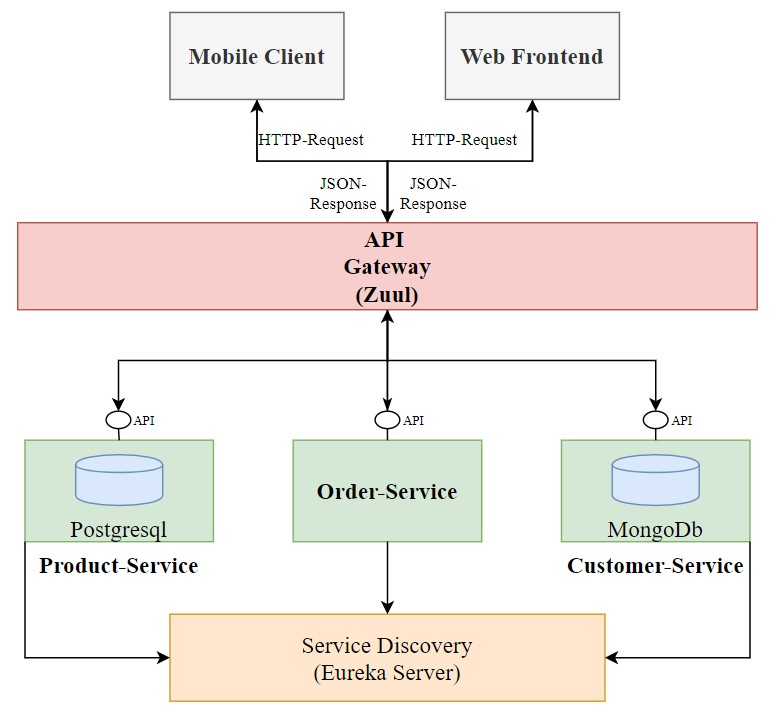

# ADF Microservice Structure

## High Level Overview of new Architecture based on Microservices

### Used Technology Stack

#### Spring Framework

Java Framework, which can be used to create fully separated Applications. In this case, Spring is used to create five different Microservices designed to simulate the business need of the ADF Application

1. API Gateway (Zuul): This Microservice is designed to act like an API Gateway. Simply put: It is the entry point to the whole application. All Other Microservices are "hiding" behind this gateway.
2. Service Discovery (Eureka Server): Enables cross-service communication between single services. Every Microservice is considered as a Client, which registers itself at the Discovery Server.
3. Customer-Service: This Service is the first "Business Logic Service" stores different Dealers(Customers) with important information about them. 
4. Product-Service: This Service stores all products(parts) which can be ordered by customers. 
5. Order-Service: This Service uses both of the other business services to gather all information needed to create an order.

#### Data Persistance

1. Customer Data persists in a MongoDB instance.
2. Product Data persists in a PostgresSQL instance.
3. Order Data doens´t need any persistance. For Later instances it may be possible to include PostgresSQL/MongoDB or any other DB-technology.

### API Configuration

